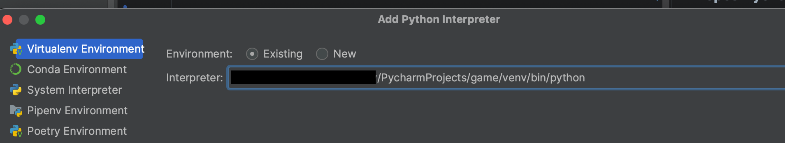

# LaLaLa Game
## Подготовка интерпритатора
*Для корректной работы проекта требуется Python 3.11* 
1. В корневой папке проекта game/ в треминале создаем вирутальную среду
> python -m venv venv

2. Активируем среду 
### Через терминал
- Windows:
> venv/bin/activate
    
- Unix, MacOS:
> source venv/bin/activate
### Через Pycharm (Community)

+ Жмем Ok
## Установка библиотек

Когда в idea настроен интрпритатор и запущена виртуальная среда нужно устновить все необходимые библиотеки 
+ Из корневой папки game/ в терминале 
> pip install -r requirements.txt 
## Запускаем проект
### 1 вариант с помощью терминала
> cd game

> python manage.py migrate

> python manage.py runserver
### 2 вариант с помощью idea
+ Если используется Pycharm (Community)

+ В папке game/ ищем файл manage.py

+ Жмем Apply -> Ok

+ В терминале
> cd game

> python manage.py migrate
+ Запускаем 

